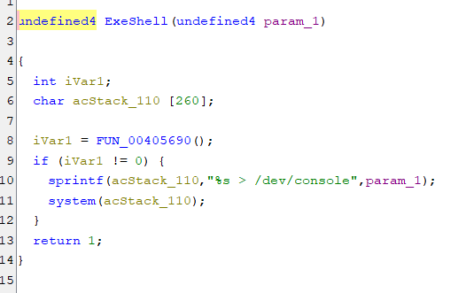
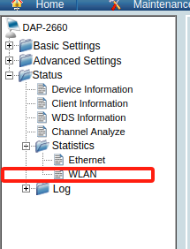
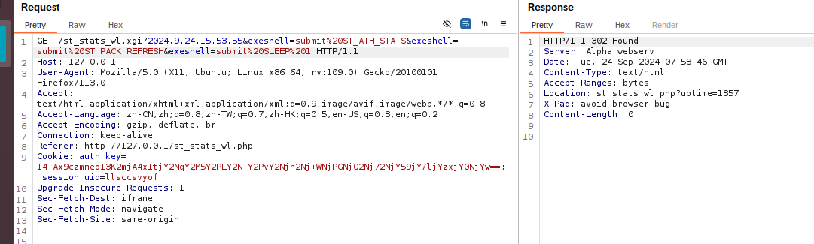
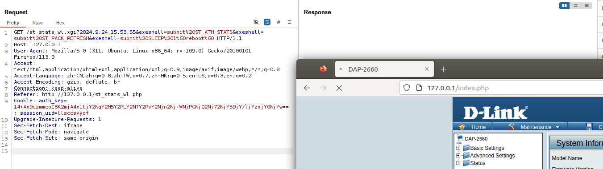

# DAP2660
Firmware Information：DAP-2660_firmware_v2.00r140.bin
Download link：[DAP-2660_REVA_FIRMWARE_v2.00R140.zip](https://support.dlink.com/resource/products/DAP-2660/REVA/DAP-2660_REVA_FIRMWARE_v2.00R140.zip)
# Vulnerability Description：
There is a command injection vulnerability in DAP 2660 of Dlink, which can perform command execution through exeshll function in atp program.

This variable is used when requesting the st_stats_wl.xgi page on the web.

The command injection is done by concatenating the values of the exeshell parameter.

Result：
