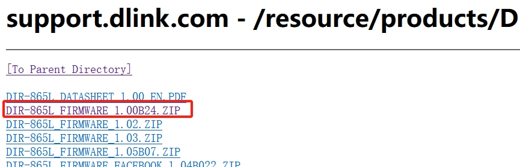
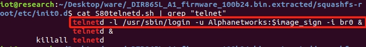
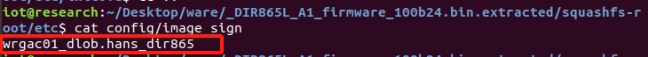
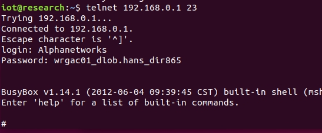

# DIR865L_A1 has a Hardcoded Password

## DIR865L_A1 
version:DIR865L_A1_firmware_100b24

## Description:
D-LINK DIR-865L_FIRMWARE_1.00B24 has a hardcoded password for the Alphanetworks account, which allows remote attackers to obtain root access via a telnet session.

## Source:
you may download it from : https://support.dlink.com/resource/products/DIR-865L/REVA/

## Analyse：
In file telnetd.sh has telnetd -l /usr/sbin/login -u Alphanetworks:$image_sign -i br0 &
 

Then in /etc/config/image_sign has hardcoded passord：

login:

