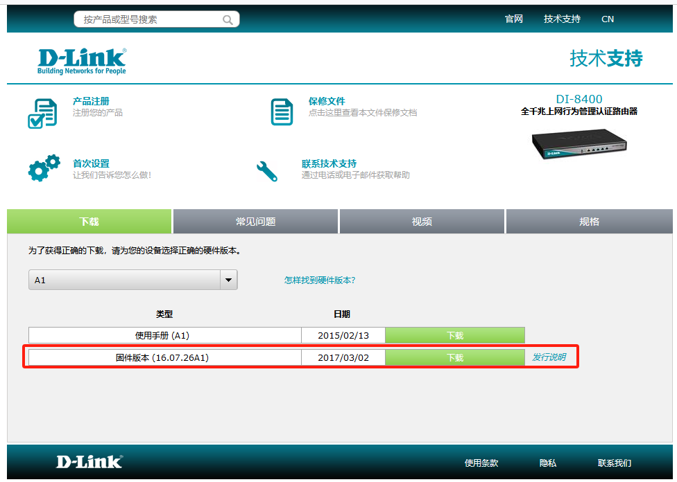
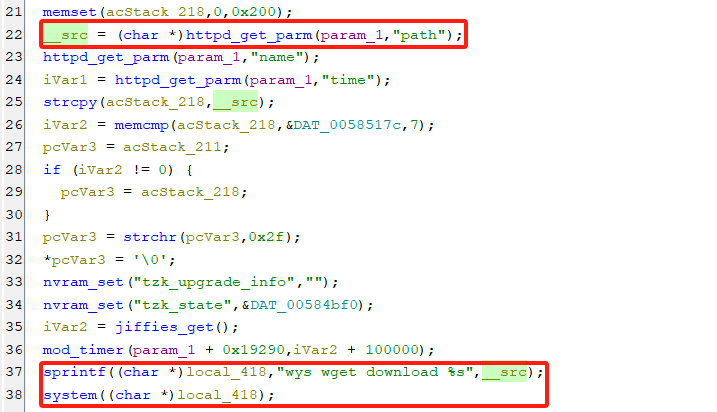
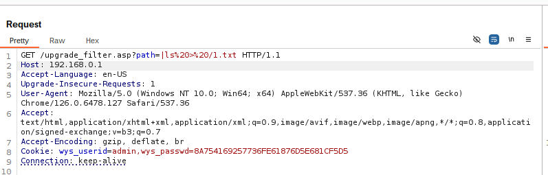
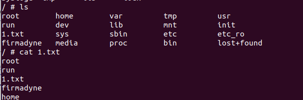

# DI_8400-16.07.26A1
## Command Injection
### DI_8400_Firmware
version:DI_8400-16.07.26A1
### Description:
In DI-8400 firmware, there is a command injection vulnerability that can operate on path when the function upgrade_filter_asp updates the firmware in the upgrade_filter.asp page.
### Source:
you may download it from : http://www.dlink.com.cn/techsupport/ProductInfo.aspx?m=DI-8400

### Analyse：
The function upgrade_filter_asp uses httpd_get_parm to retrieve the path value in the url parameter, which is then concatenated by sprintf during the run of the function and then executed through the system.

The upgrade_filter.asp page is accessed and a poc is constructed to see if the command injection is possible.

FirmAE is used here for firmware simulation.
